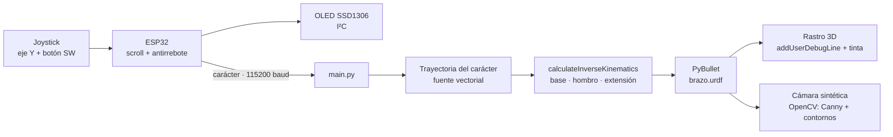
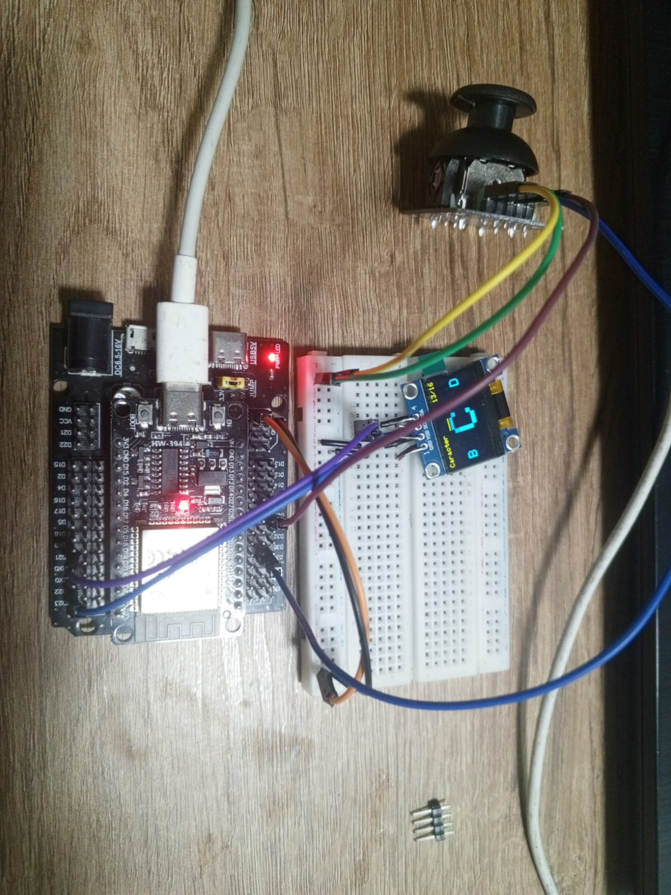
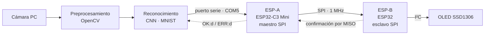
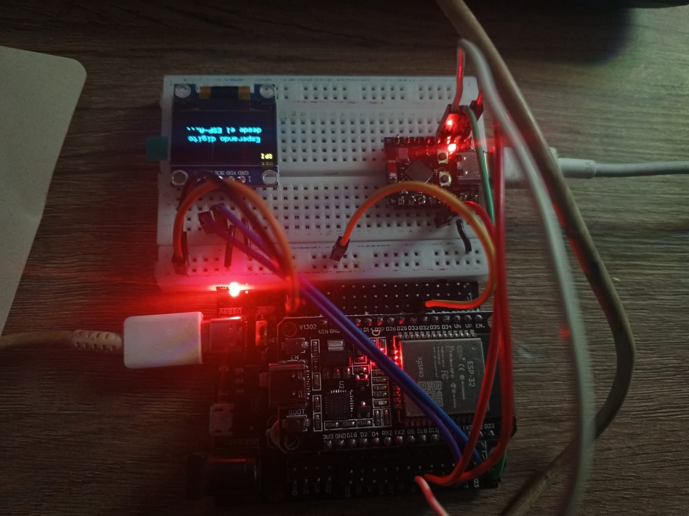

# OpenCV · PyBullet · ESP32 · CNN — Actividad 6


| Autor | Actividad | Herramientas |
|---|---|---|
| Johan Andrés Canchala Arenas ([@Johan-C777](https://github.com/Johan-C777)) | Actividad 6 · Puntos 1 y 2 | Python · PyBullet · OpenCV · TensorFlow/Keras · Arduino (ESP32 y ESP32-C3) |

Este repositorio contiene dos sistemas que unen hardware real con software de simulación y visión artificial:

| Punto | Carpeta | Qué hace | Hardware | Técnicas principales |
|---|---|---|---|---|
| **1** | [`Act6.1/`](Act6.1) | Un brazo robótico simulado dibuja en una pizarra el carácter que el usuario elige en el ESP32 | ESP32 + joystick + OLED I²C | Cinemática inversa, planificación de trayectorias, visión (Canny + contornos) |
| **2** | [`Act6.2/`](Act6.2) | Reconoce dígitos escritos a mano con la cámara y los muestra en una OLED pasando por dos ESP32 conectados por SPI | ESP32-C3 Mini (maestro) + ESP32 (esclavo) + OLED I²C | CNN (MNIST), OpenCV, UART, SPI, I²C |

---

## 📑 Contenido

1. [Enunciado y cumplimiento](#-enunciado-y-cumplimiento)
2. [Estructura del repositorio](#-estructura-del-repositorio)
3. [Requisitos](#-requisitos)
4. [Paso a paso de ejecución](#-paso-a-paso-de-ejecución)
5. [Punto 1 — Brazo robótico que dibuja](#-punto-1--brazo-robótico-que-dibuja-en-pybullet)
6. [Punto 2 — Dígitos con CNN, SPI y OLED](#-punto-2--reconocimiento-de-dígitos-con-cnn--spi--oled)
7. [Solución de problemas](#-solución-de-problemas)
8. [Referencias](#-referencias)

---

## 📋 Enunciado y cumplimiento

| Enunciado | Cómo se cumple |
|---|---|
| **Punto 1:** *Teclado I²C + simulación de brazo robótico en PyBullet dibujando* | El usuario elige un carácter (`0–9`, `A–D`, `*`, `#`) con un joystick y lo ve en una OLED por I²C. Al presionar el botón, el ESP32 lo envía por serie y el brazo `brazo.urdf` lo dibuja en PyBullet usando cinemática inversa. Una cámara sintética analiza el dibujo con OpenCV. |
| **Punto 2:** *Reconocimiento de dígitos escritos a mano con OpenCV + pantalla OLED I²C + comunicación SPI* | Se sigue exactamente el esquema pedido: cámara PC → preprocesamiento OpenCV → CNN → puerto serie → ESP-A (maestro SPI) → SPI → ESP-B (esclavo SPI) → OLED I²C. |

> [!NOTE]
> En el Punto 1 el enunciado propone un teclado matricial. Este montaje usa un **joystick analógico** para recorrer los caracteres y una **OLED SSD1306 por I²C** para mostrarlos. Cumple la misma función: el usuario elige físicamente qué carácter se dibuja.

---

## 📂 Estructura del repositorio

```text
OpenCV-PyBullet-ESP32-CNN/
├── Act6.1/                          # Punto 1: brazo que dibuja
│   ├── Act6.1.ino                   # ESP32: joystick + OLED + envío serial del carácter
│   ├── Montaje.jpg                  # Foto del montaje físico
│   ├── brazo.urdf                   # Modelo del brazo (base, hombro, extensión, pinza)
│   └── main.py                      # PyBullet: trayectorias, IK, rastro y visión OpenCV
├── Act6.2/                          # Punto 2: dígitos con CNN + SPI
│   ├── ESP_A_Maestro/
│   │   └── ESP_A_Maestro.ino        # ESP32-C3 Mini: serie -> SPI (maestro)
│   ├── ESP_B_Esclavo/
│   │   └── ESP_B_Esclavo.ino        # ESP32: SPI (esclavo) -> OLED I²C
│   ├── Montaje_2.jpg                # Foto del montaje físico
│   ├── entrenar_modelo.py           # Entrena la CNN con MNIST (una sola vez)
│   └── reconocer_digito.py          # Cámara + OpenCV + CNN + envío al ESP-A
└── README.md
```

---

## 📦 Requisitos

**Software**

- Windows con PowerShell (los comandos del paso a paso están escritos para Windows).
- Python 3.8 o superior con:

  ```powershell
  pip install pybullet opencv-python numpy pyserial tensorflow
  ```

- Arduino IDE con el paquete de placas **esp32 de Espressif** (un solo paquete instalado; ver [Solución de problemas](#-solución-de-problemas)).
- Librerías de Arduino (desde el Gestor de librerías):
  - **Adafruit SSD1306**, que instala también Adafruit GFX. Se usa en `Act6.1.ino`.
  - **U8g2** (by oliver), para los dígitos grandes. Se usa en `ESP_B_Esclavo.ino`.

**Hardware**

| Punto | Componentes |
|---|---|
| 1 | ESP32, joystick analógico con pulsador, OLED SSD1306 128×64 I²C |
| 2 | ESP32-C3 Mini (maestro), ESP32 DevKit (esclavo), OLED SSD1306 128×64 I²C, jumpers |

> [!WARNING]
> Alimenta joysticks y OLED a **3.3 V**. Los GPIO del ESP32 no toleran 5 V.

---

## 🚀 Paso a paso de ejecución

> [!CAUTION]
> **Paso cero: permisos de Windows (solo si falla el activador del entorno virtual).**
> Si al activar `.venv` aparece que *"la ejecución de scripts está deshabilitada"*, ejecuta esto en esa misma terminal:
>
> ```powershell
> Set-ExecutionPolicy -Scope Process -ExecutionPolicy Bypass
> ```

### Punto 1 · Brazo que dibuja

1. **Firmware:** abre `Act6.1/Act6.1.ino`, selecciona la placa **ESP32 Dev Module** y el puerto, y súbelo. Al encender, la OLED muestra "Calibrando": no toques el joystick durante ese segundo.
2. **Cierra el Monitor Serie** de Arduino, porque ocupa el puerto.
3. **Puerto:** en `main.py`, ajusta `PUERTO_SERIAL` al COM del ESP32 (por defecto `COM3`).
4. **Ejecuta** desde la carpeta del punto, porque `brazo.urdf` debe estar junto a `main.py`:

   ```powershell
   cd .\Act6.1
   python main.py
   ```

5. Elige un carácter con el joystick y presiona el botón: la OLED muestra "Enviando..." y el brazo lo dibuja.
6. Sin ESP32 conectado también funciona con el teclado en la ventana de visión: `0–9`, `a–d`, `*`, `#` dibujan, `L` limpia la pizarra y `Q` sale.

### Punto 2 · Dígitos con CNN, SPI y OLED

1. **Entrenar la CNN (una sola vez).** Genera `modelo_mnist_cnn.h5` en la carpeta:

   ```powershell
   cd .\Act6.2
   python entrenar_modelo.py
   ```

2. **ESP-B (esclavo):** abre `ESP_B_Esclavo.ino`, selecciona **ESP32 Dev Module** y súbelo. La OLED debe mostrar *"Esperando digito desde el ESP-A..."*.
3. **ESP-A (maestro):** abre `ESP_A_Maestro.ino` y selecciona **ESP32C3 Dev Module**.
   - En *Herramientas*, pon **USB CDC On Boot: Disabled**. Esta placa se comunica con el PC mediante un chip **CH340**, así que `Serial` debe salir por la UART0.
   - Si el puerto COM aparece y desaparece, entra en modo descarga (mantén **BOOT**, pulsa **RST** y suelta) y vuelve a subir.
4. **Cablea el bus SPI y la tierra común** según la [tabla de conexiones](#hardware-y-conexiones).
5. **Puerto:** en `reconocer_digito.py`, ajusta `PUERTO` al COM del ESP-A (por defecto `COM5`).
6. **Ejecuta** desde la carpeta donde está el `.h5`:

   ```powershell
   cd .\Act6.2
   python reconocer_digito.py
   ```

7. Escribe un dígito grande y oscuro en papel blanco y ponlo dentro del recuadro verde. Cuando la predicción es estable, el número aparece en la OLED del ESP-B. En el video de la cámara verás abajo `Enviado al ESP-A: d  OK:d`.

---

## 🤖 Punto 1 — Brazo robótico que dibuja en PyBullet

### Arquitectura



### Hardware y controles

| Componente | Pin ESP32 |
|---|---|
| OLED SDA | GPIO 21 |
| OLED SCL | GPIO 23 |
| Joystick VRy | GPIO 34 (ADC1) |
| Joystick SW | GPIO 25 (`INPUT_PULLUP`) |
| VCC de OLED y joystick | 3.3 V |

| Acción | Resultado |
|---|---|
| Mover el joystick en Y | Recorre `0 1 2 … 9 A B C D * #`. Sostenido, avanza solo: primero espera 500 ms y luego avanza cada 220 ms. |
| Presionar SW | Envía el carácter por serie (`"7\n"`) y la OLED muestra *"Enviando..."* |

### Explicación del código

**`Act6.1.ino`**

| Bloque | Qué hace |
|---|---|
| `calibrarCentro()` | Mide el reposo real del eje Y al encender. Ningún joystick queda exactamente en 2048. |
| Scroll con umbral | Cambia de carácter solo si el stick se aleja más de ±1200 del centro, y exige volver a menos de ±400 antes de contar otro toque. Así no "salta" números. |
| Antirrebote | La lectura del botón debe mantenerse estable 30 ms. Solo se dispara al presionar, no al soltar. |
| `pantallaSeleccion()` | Muestra el carácter grande (36×48 px) en el centro, sus vecinos a los lados y la posición (`3/16`). |
| `pantallaEnviando()` | Muestra *"Enviando..."* durante 800 ms después de enviar. |

**`main.py`**

| Bloque | Qué hace |
|---|---|
| `FUENTE` + `arco()` | Fuente vectorial propia: cada carácter es una lista de trazos (segmentos y arcos de elipse) en un cuadro de 0 a 1. |
| `rutaCartesiana()` | Convierte los trazos en *waypoints* 3D, uno por paso de simulación: ir con el lápiz levantado, bajar, recorrer el trazo y levantar. |
| `Cinematica.ik()` | Llama a `p.calculateInverseKinematics` y aplica el resultado solo a los 3 joints del brazo. |
| `Dibujante` | Máquina de estados no bloqueante: `REPOSO → IR → DIBUJAR → ESPERAR → VOLVER`. Si llegan varios caracteres, los pone en cola. |
| `entintar()` | Deja tinta donde la punta real toca la pizarra: una línea con `addUserDebugLine` y gotas visibles para la cámara. |
| `Vision.procesar()` | Toma la cámara sintética, aplica Canny y detecta el contorno del carácter dibujado. |
| `LectorSerial` | Lee el puerto sin bloquear y solo acepta líneas completas con un carácter válido. |

### Análisis

**1. El brazo es esférico (R-R-P).** Al leer `brazo.urdf` se ve que `joint_gripper` no abre la pinza: es un joint **prismático a lo largo del brazo**, es decir, una extensión telescópica. Con giro de base ($\theta_1$), inclinación ($\theta_2$) y extensión ($d$), la punta de los dedos (el "lápiz") queda en:

$$
\mathbf{p}_{punta} = \mathbf{h} + (0.42 + d)
\begin{bmatrix} \sin\theta_2\cos\theta_1 \\ \sin\theta_2\sin\theta_1 \\ \cos\theta_2 \end{bmatrix}
$$

donde $\mathbf{h} = (0, 0, 0.50)$ m es el hombro y $0.42 = 0.30$ (brazo) $+ 0.12$ (dedos). Con 3 grados de libertad puede alcanzar cualquier punto de un casquete esférico. La pizarra se ubicó en el plano $x = 0.48$ m, donde todos los puntos del carácter quedan a una distancia del hombro entre 0.44 y 0.51 m, dentro del alcance de 0.42 a 0.57 m.

**2. Cinemática inversa.** La IK se calcula para el link `gripper_base`, retrocediendo el objetivo 0.12 m sobre la línea hombro–punta: $\mathbf{p}_{pinza} = \mathbf{p} - 0.12\,\hat{\mathbf{u}}$. Hubo dos detalles de PyBullet:

- En modo *nullspace* (con límites articulares), PyBullet calcula mal el joint prismático: pedía 0.69 m de extensión cuando el límite es 0.15 m. Por eso se usa la IK sin nullspace y el resultado se recorta a los límites del URDF.
- Un brazo esférico tiene dos soluciones: $(\theta_1, \theta_2)$ y $(\theta_1 \pm 180°, -\theta_2)$. La primera IK de cada carácter arranca desde una postura "semilla" mirando a la pizarra para caer siempre en la solución correcta.

**3. De la fuente al plano.** Cada punto $(u, v)$ de la fuente se lleva al plano de la pizarra. Visto desde el robot, la derecha es $-y$:

$$
y = -\,(u - 0.5)\cdot 0.18, \qquad z = 0.50 + (v - 0.5)\cdot 0.28
$$

El lápiz baja al plano $x = 0.48$ para dibujar y se levanta a $x = 0.44$ entre trazos.

**4. Visión.** `addUserDebugLine` no aparece en las imágenes de `getCameraImage`, así que además de la línea se dejan gotas de "tinta" como cuerpos visuales. El procesamiento es:

1. Escala de grises y desenfoque gaussiano.
2. **Canny**, que se muestra en el panel derecho.
3. Máscara de la pizarra, obtenida del buffer de segmentación.
4. Umbral inverso y cierre morfológico.
5. `findContours`, con el contorno y la caja envolvente dibujados sobre la imagen.

**Resultados medidos** (16 caracteres, con los parámetros actuales de `main.py`):

| Métrica | Valor |
|---|---|
| Error de la IK (punta vs. objetivo) | 0.001 mm |
| Error de la tinta respecto al trazo ideal | ≤ 0.37 mm |
| Cobertura del trazo | 100 % |
| Tiempo por carácter | 2.5 – 4.9 s |

### Problemas encontrados y cómo se resolvieron

| Síntoma | Causa | Solución |
|---|---|---|
| La IK daba una extensión de 0.69 m | El modo *nullspace* de PyBullet no maneja bien el joint prismático | IK sin nullspace + recorte a límites |
| A veces el brazo buscaba la pizarra "al revés" | Solución espejo del brazo esférico | Semilla de IK mirando a la pizarra |
| La cámara no veía el dibujo | Las líneas de depuración no se renderizan en `getCameraImage` | Tinta como cuerpos visuales (esferas) |
| El brazo se quedaba atrás de la trayectoria | Motores limitados al esfuerzo y velocidad del URDF | Motores reforzados (fuerza 5000, velocidad 10, ganancia 1.0) y trazo a 0.40 m/s |
| Manchas de tinta al acercarse o alejarse | La punta cruzaba el plano durante los movimientos de ida y vuelta | Tinta solo en el estado `DIBUJAR` |

### Evidencias

<p align="center"></p>

[](https://videotourl.com/videos/1790625265363-003e3429-9e12-429a-83ca-379ed2d3ce00.mp4)

---

## 🔢 Punto 2 — Reconocimiento de dígitos con CNN + SPI + OLED

### Arquitectura

Es el esquema del enunciado, bloque por bloque:



| Bloque del enunciado | Dónde está |
|---|---|
| Cámara PC | `reconocer_digito.py` → `cv2.VideoCapture(0)` |
| Preprocesamiento OpenCV | `preprocesar_digito()` |
| Reconocimiento CNN | `modelo.predict()` con `modelo_mnist_cnn.h5` (creado por `entrenar_modelo.py`) |
| Envío por puerto serie | clase `EnlaceESP` |
| ESP-A (maestro SPI) → envío por SPI | `ESP_A_Maestro.ino` |
| ESP-B (esclavo SPI) → mostrar OLED I²C | `ESP_B_Esclavo.ino` |

### Hardware y conexiones

El maestro es un **ESP32-C3 Mini** y el esclavo un **ESP32 clásico**. Sus pines SPI son distintos, así que el cableado se hace **por función**, no por número de pin:

| Señal | ESP-A · ESP32-C3 Mini | ESP-B · ESP32 (VSPI) |
|---|---|---|
| SCK | GPIO 4 | GPIO 18 |
| MISO | GPIO 5 | GPIO 19 |
| MOSI | GPIO 6 | GPIO 23 |
| CS | GPIO 7 | GPIO 5 |
| GND | GND | GND (**obligatorio**, referencia común) |

| OLED (solo en el ESP-B) | Pin ESP32 |
|---|---|
| SDA | GPIO 21 |
| SCL | GPIO 22 |
| VCC | 3.3 V (dirección I²C 0x3C) |

### Protocolos

**PC → ESP-A (serie, 115200 baudios):** un dígito por línea, p. ej. `7\n`. El ESP-A responde `OK:7` si el ESP-B confirmó el dígito, o `ERR:7` si no.

**ESP-A ↔ ESP-B (SPI modo 0, 1 MHz, 4 bytes):**

| Dirección | Byte 0 | Byte 1 | Byte 2 | Byte 3 |
|---|---|---|---|---|
| Maestro → Esclavo | `0xA5` | dato: `0–9` o `0xFF` (consulta) | `~dato` | `0x5A` |
| Esclavo → Maestro | `0xB6` | dígito que muestra (`0xFF` = ninguno) | `~dígito` | `0x6B` |

Cabecera, cola y byte complementado permiten descartar tramas corruptas. En SPI la respuesta del esclavo viaja en la transacción siguiente. Por eso el maestro envía el dígito y luego una **consulta** para confirmar que el ESP-B lo está mostrando. Reintenta hasta 3 veces.

### Explicación del código

**`entrenar_modelo.py`:** CNN entrenada sobre MNIST con *data augmentation* (rotación ±10°, desplazamiento 10 %, zoom 10 %) durante 10 épocas.

| Capa | Salida | Parámetros |
|---|---|---|
| Conv2D 32 (3×3) + ReLU | 26×26×32 | 320 |
| MaxPooling 2×2 | 13×13×32 | 0 |
| Conv2D 64 (3×3) + ReLU | 11×11×64 | 18 496 |
| MaxPooling 2×2 | 5×5×64 | 0 |
| Flatten | 1600 | 0 |
| Dense 128 + ReLU, Dropout 0.5 | 128 | 204 928 |
| Dense 10 + Softmax | 10 | 1 290 |
| **Total** | | **225 034** |

**`reconocer_digito.py`**

| Bloque | Qué hace |
|---|---|
| `preprocesar_digito()` | Convierte la ROI en una imagen tipo MNIST (detalle abajo). |
| Votación | Guarda las últimas 5 predicciones para evitar parpadeos. |
| `EnlaceESP` | Envía el dígito al ESP-A **solo cuando es estable y cambió**, lee sus confirmaciones sin bloquear y las muestra en el video. |

**`ESP_A_Maestro.ino` (ESP32-C3):**
- Lee el puerto serie sin bloquear.
- Arma la trama, la envía por SPI con `SPI.begin(4, 5, 6, 7)` y confirma con una consulta.
- Cada 2 s envía una consulta de "latido". Si el ESP-B se reinició y ya no muestra el último dígito, se lo reenvía.

**`ESP_B_Esclavo.ino` (ESP32):**
- El núcleo Arduino-ESP32 no trae modo esclavo SPI. Por eso se usa el driver oficial del ESP-IDF (`driver/spi_slave.h`) sobre `SPI3_HOST` (VSPI).
- Siempre deja una transacción en cola, porque el esclavo solo recibe si ya tiene una lista cuando el maestro baja CS.
- Valida la trama y prepara su respuesta **antes** de actualizar la OLED, que tarda unos 25 ms por I²C.
- Dibuja el dígito con la fuente `logisoso58` de U8g2: 58 px de alto, centrado.
- Si pasan 5 s sin latido del maestro, muestra "sin enlace".

### Análisis

**1. Preprocesamiento estilo MNIST.** La CNN solo reconoce bien imágenes parecidas a las de MNIST: dígito blanco sobre fondo negro, de unos 20×20 px, centrado por su centro de masa en un lienzo de 28×28. `preprocesar_digito()` reproduce ese formato:

1. Escala de grises y desenfoque gaussiano 5×5.
2. Umbral adaptativo gaussiano invertido (bloque 11, C = 2), robusto a sombras e iluminación desigual.
3. Contorno externo más grande. Si su área es menor a 500 px se descarta como ruido.
4. Recorte y escalado a 20 px en el lado mayor, manteniendo la proporción.
5. Pegado en un lienzo de 28×28, centrado por el centro de masa.
6. Normalización a [0, 1].

**2. Cuándo se envía un dígito.** Enviar en cada frame saturaría el puerto con el mismo número. Se envía solo si se cumplen tres condiciones a la vez:

- confianza de la predicción mayor al 60 %;
- al menos 4 de las últimas 5 predicciones coinciden, y la predicción actual es esa misma clase;
- el dígito es distinto al último enviado.

Si el recuadro queda vacío más de 1 s, se "olvida" el último envío. Así, mostrar otra vez el mismo número lo vuelve a enviar.

**3. Robustez del enlace.** La confirmación por MISO verifica la cadena completa PC → ESP-A → ESP-B de extremo a extremo. El latido cada 2 s permite que cualquiera de las dos placas se reinicie sin perder la sincronía.

### Problemas encontrados y cómo se resolvieron

| Síntoma | Causa | Solución |
|---|---|---|
| El ESP32-C3 no respondía a Python (placa "muda") | Con `USB CDC On Boot: Enabled`, `Serial` sale por el USB nativo del C3, pero esta placa se conecta al PC mediante un **CH340** | `USB CDC On Boot: Disabled` → `Serial` usa la UART0 conectada al CH340 |
| El puerto COM aparecía y desaparecía | La placa se reiniciaba en bucle | Modo descarga: mantener **BOOT** y pulsar **RST**, luego subir el código |
| Arduino IDE mostraba *"NO BOARDS FOUND"* | Índice de placas corrupto por tener dos paquetes ESP32 instalados | Borrar `%LOCALAPPDATA%\Arduino15\packages` y dejar un solo paquete ESP32 |
| Python no encontraba el módulo `serial` | Faltaba la librería | `pip install pyserial` |
| `FileNotFoundError` al cargar `modelo_mnist_cnn.h5` | La terminal estaba en otra carpeta | Ejecutar desde la carpeta del modelo (`cd`) |
| Los pines SPI no coinciden entre placas | El ESP32-C3 no tiene VSPI; su SPI usa los GPIO 4–7 | Cableado cruzado por función + GND común |
| Con la hoja en blanco se "detectaba" un dígito | El recuadro verde se dibujaba antes de recortar la ROI y su borde entraba al análisis | Recortar la ROI (copia) antes de dibujar el recuadro |

### Evidencias

<p align="center"></p>

[](https://videotourl.com/videos/1790625313075-8f4891e4-45a9-4854-8317-0e758e3841dd.mp4)
---

## 🧯 Solución de problemas

| Problema | Qué revisar |
|---|---|
| *"La ejecución de scripts está deshabilitada"* al activar `.venv` | Ejecutar el [paso cero](#-paso-a-paso-de-ejecución). |
| `Sin hardware serial` / `No se pudo abrir COMx` | COM incorrecto en el script, Monitor Serie de Arduino abierto o cable USB que solo carga. |
| La OLED no enciende | Dirección 0x3C (algunas son 0x3D), SDA/SCL invertidos o falta de 3.3 V. |
| En el video aparece `ERR:d` | Revisar MISO, CS y la **GND común** entre las dos placas. |
| La OLED del ESP-B dice "sin enlace" | El ESP-A no está enviando latidos: revisar SCK, MOSI y CS. |
| El dígito no se reconoce bien | Escribir grande, con trazo grueso y oscuro sobre papel blanco, centrado en el recuadro y con buena luz. |
| El joystick del Punto 1 recorre al revés | Cambiar `INVERTIR_Y` a `true` en `Act6.1.ino`. |

---

## 📚 Referencias

- [PyBullet Quickstart Guide](https://pybullet.org/wordpress/): `calculateInverseKinematics`, `getCameraImage`, `addUserDebugLine`.
- [MNIST en Keras](https://keras.io/api/datasets/mnist/): conjunto de datos de dígitos manuscritos.
- [ESP-IDF · SPI Slave Driver](https://docs.espressif.com/projects/esp-idf/en/latest/esp32/api-reference/peripherals/spi_slave.html): driver usado en el ESP-B.
- [U8g2](https://github.com/olikraus/u8g2) y [Adafruit SSD1306](https://github.com/adafruit/Adafruit_SSD1306): librerías de la OLED.
- [Espressif · Arduino Core para ESP32](https://github.com/espressif/arduino-esp32).
